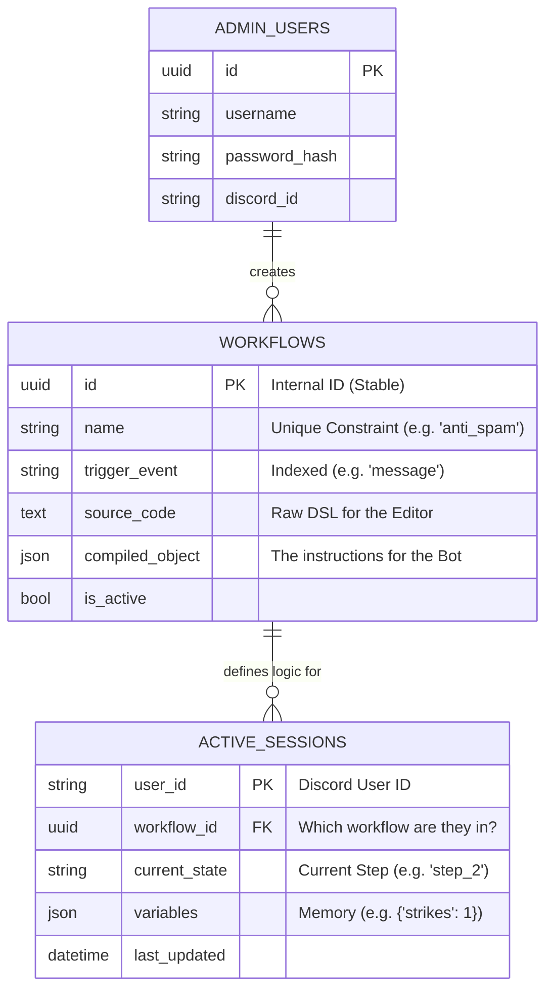

It is great that you are challenging the design. Critical analysis prevents technical debt. Here is the debate and clarification regarding your database concerns.

### 1. GitHub & SQLite: The "Push" Misconception

**Question:** If I initialize the DB and push it to GitHub, does my friend get the data?
**Answer:** Technically **Yes**, but practically **No (and you shouldn't do it)**.

* **How it works:** SQLite is just a file (`guildflow.db`). If you remove it from your `.gitignore` and push it, your friend will download that exact file, including all your test data.
* **The Trap:**
1. **Merge Conflicts:** If you add a user and your friend adds a workflow, git cannot merge the binary `.db` file. You will corrupt the database.
2. **Security:** You might accidentally push real user IDs or tokens.


* **The Solution:**
* **Do not push the `.db` file.** Add `*.db` to `.gitignore`.
* **Push the Schema (Code):** You push `models.py`. When your friend runs the app, the code `Base.metadata.create_all()` runs and builds an *empty* structure identical to yours. They start fresh; you keep your test data.


---

### 2. The Database Debate

I will defend the original architecture while accepting your valid point about the `USERS` table.

#### **Point A: "The WORKFLOWS table is weird. Why is workflow_name the ID?"**

**Your Argument:** We should use an `INT` or `UUID` as the primary key and keep the name as a normal column.
**My Defense:**
Using `workflow_name` as the Primary Key (PK) was a strategic choice for the **Compiler-First** architecture, but I concede that a UUID is safer for *internal* references.

* **Why Name as PK was proposed:** In a DSL, unique names are mandatory. You cannot have two workflows named `anti_spam`. If you reference `ENTER_STATE step_2`, the compiler needs to find that exact unique identifier. Using the name as the PK enforces this uniqueness at the database level without extra code.
* **The Flaw in my original design:** If an admin renames a workflow, all links break.
* **The Compromise (Better Design):**
* **Primary Key:** `UUID` (Internal stability).
* **Unique Constraint:** `workflow_name` (User-facing uniqueness).
* **Column `source_text`:** You asked for "DSL content". Yes, we absolutely need to store the *original* text so the admin can edit it later. The `compiled_json` is for the bot; the `source_text` is for the human.


#### **Point B: "I still do not understand the Active Sessions table."**

**The Defense:** This table is the **heart** of the bot. Without it, your bot is "stupid" (stateless).

* **The Problem:** Discord is stateless. When a user types "Yes", the bot doesn't know *what* they are saying "Yes" to. Are they agreeing to the rules? Or confirming a ban?
* **The Solution (`active_sessions`):** This is the bot's Short-Term Memory.
* *Scenario:* A user triggers the `report_user` workflow.
* **Step 1:** Bot asks "Who are you reporting?" -> Bot saves to DB: `User: 123 | State: waiting_for_target`.
* **Step 2:** User types "@badguy".
* **Step 3:** Bot checks DB. "Ah, User 123 is in `waiting_for_target` state." -> Bot executes the logic for that step.
* **Step 4:** Bot updates DB: `User: 123 | State: waiting_for_reason`.


* **Why it's not a "Web Session":** This isn't about logging into the website. It is a **Finite State Machine (FSM) tracker** for Discord interactions.

#### **Point C: "We need a USERS table for the Admin Dashboard."**

**Verdict:** **Agreed.**
The original documentation focused on the *Bot's* logic, missing the *Web's* requirement. You need an `admin_users` table for login/auth (unless you rely purely on Discord OAuth).

---

### 3. The Improved Database Design (Final Schema)

This schema resolves your concerns: it adds UUIDs, stores the raw DSL, and includes Admin Users.



### 4. Implementation for Member B (Updated Models)

Copy this into `src/database/models.py`. It implements the "Compromise" design.

```python
from sqlalchemy import Column, String, Boolean, DateTime, ForeignKey, JSON, Text
from sqlalchemy.sql import func
from .db import Base
import uuid

def generate_uuid():
    return str(uuid.uuid4())

# 1. ADMIN USERS (For Web Dashboard Login)
class AdminUser(Base):
    __tablename__ = "admin_users"
    
    id = Column(String, primary_key=True, default=generate_uuid)
    username = Column(String, unique=True, nullable=False)
    password_hash = Column(String, nullable=False)
    discord_id = Column(String, nullable=True) # Optional: Link to Discord account

# 2. WORKFLOWS (The Blueprint)
class Workflow(Base):
    __tablename__ = "workflows"

    id = Column(String, primary_key=True, default=generate_uuid)
    name = Column(String, unique=True, nullable=False)  # Enforce unique names
    trigger_event = Column(String, nullable=False, index=True)
    
    source_code = Column(Text, nullable=True)   # RAW DSL (What the admin typed)
    compiled_json = Column(JSON, nullable=False) # MACHINE CODE (What the bot reads)
    
    is_active = Column(Boolean, default=True)
    created_at = Column(DateTime(timezone=True), server_default=func.now())

# 3. ACTIVE SESSIONS (The Bot's RAM)
class ActiveSession(Base):
    __tablename__ = "active_sessions"

    # Composite Key: One user can be in one workflow at a time
    user_id = Column(String, primary_key=True) 
    workflow_id = Column(String, ForeignKey("workflows.id"), primary_key=True)
    
    current_state = Column(String, nullable=False) # 'start', 'awaiting_reply'
    variables = Column(JSON, default={})           # Store: {"report_target": "12345"}
    last_updated = Column(DateTime(timezone=True), onupdate=func.now())
```

